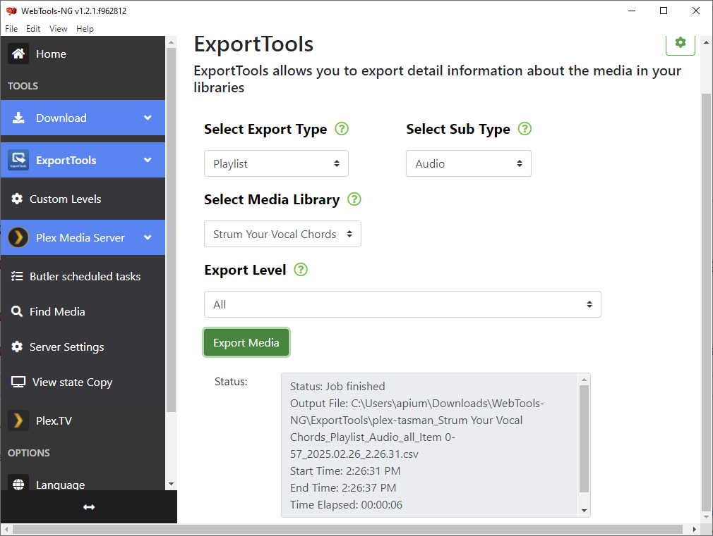

# plex-playlist-copier-converter

Download the files for a plex playlist and optionally convert to MP3

## Preparation

You must generate a CSV file with your playlist information.
This is to be done with [WebTools-NG](https://github.com/WebTools-NG/WebTools-NG).

Steps:

1. Sign into your Plex server
1. Select 'ExportTools' in the left sidebar
1. Select your server in the header
1. Select Export Type: Playlist
1. Select Sub Type: Audio
1. Select Media Library: \<Your Playlist Name\>
1. Select Export Level: All
1. Select 'Export Media'

You may also need to go to settings and set the export to be 'CSV'.

## Using the script

Then follow the script steps:

1. Copy that csv file to a folder
1. Change the name to 'plex.csv'
1. Listed in the file will be the prefix to your music, if you're running the script directly on your Plex server set "USE_PATH_REPLACEMENT" to False
1. Otherwise inspect the column "Part File Combined" in the csv and use the replacement config items to change it to a valid path on your system
1. Run the script

There are several configuration items which are self-explanatory.

## Running the script

This is designed for Python 3.10.6, you should be able to use anything after about 3.6 with no issues.

Ensure you have ffmpeg installed if you are performing conversion.
This requires no external python dependencies so should just 'work'.

`python plex-playlist-downloader.py`
